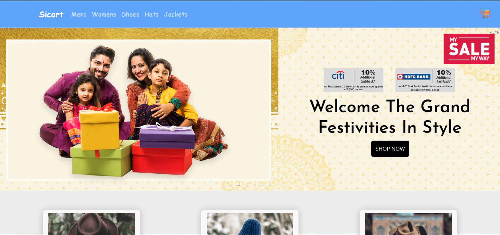

<!-- Please update value in the {}  -->

<h1 align="center">Ecommerce Site(Team sitar)</h1>

  <h3>
    <a href="https://sicart.netlify.app/">
      Demo
    </a>
     | 
    <a href="https://github.com/mohitsaran02/siCartApp">
      Solution
    </a>
  </h3>

<!-- TABLE OF CONTENTS -->

## Table of Contents

- [Overview](#overview)
- [Built With](#built-with)
- [Features](#features)
- [Contact](#contact)

<!-- OVERVIEW -->

## Overview

### Built With

<!-- This section should list any major frameworks that you built your project using. Here are a few examples.-->

- ReactJs
- Bootstrap 
- css
- Redux toolkit

## Features

<!-- List the features of your application or follow the template. Don't share the figma file here 🙂 -->

This application/site was created as a submission to a [Devsnest](https://www.devsnest.in/) challenge. The [challenge](https://devchallenges.io/challenges/wBunSb7FPrIepJZAg0sY) was to build and ecommerce site with more than 50 products with a functional cart.

- adding product to the cart 
- order checkout 
- more than 50 products 

## Contact

<h1>powered by Sitar Team</h1>